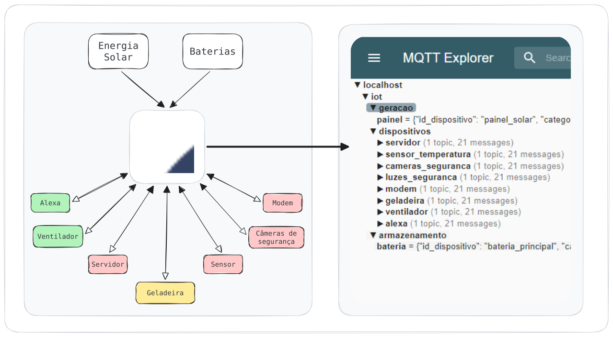

  
  
  
  
  

# Que projeto é esse?
É um pipeline construído para otimizar o uso da energia gerada pelo sistema fotovoltaico durante a noite ou em momentos emergentes em tempo real. A ideia principal é desligar IoTs com base na capacidade da bateria e nível de prioridade, mas religá-los aos poucos quando a geração for mais que o próprio consumo.

> É um projeto pessoal para portifólio

## Lógica da Otimização
O projeto simulada diversos IoTs que consomem a capacidade da bateria, mas a ordem em que são desligados vai de acordo com seu **nível de importância(prioridade)**. 
### Exemplo
| Prioridade | Categoria       |Exemplos                                                          |      Desliga(geração OFF)       |        Liga(geração ON)        | Alerta |
| :--------: | :-------------- | :------------------------------------------------------------------------------------- | :----------------: | :----------------: | ------ |
|   **1**    | **Crítico**     | Servidor local, Luzes de emergência, roteador de internet, alarmes e sensores críticos | **10%** da bateria | **15%** da bateria | ⚠️      |
|   **2**    | **Essencial**   | Geladeiras e lâmpadas principais                                                       | **20%** da bateria | **30%** da bateria | 🔴     |
|   **3**    | **Importante**  | Computadores de trabalho e ventiladores                                                | **35%** da bateria | **65%** da bateria | 🟡     |
|   **4**    | **Secundário**  | Ar-condicionado, TVs e som ambiente                                                    | **50%** da bateria | **80%** da bateria | 🟢     |
|   **5**    | **Superficial** | Irrigação do jardim, luzes decorativas e piscina                                       | **60%** da bateria | **90%** da bateria | 🟢     |
> Deve ser modificado para se adequar à sua realidade ou objetivo.

## Qual a relação dos IoTs, Mosquitto e Kafka?

**Recursos Limitados (IoT):** Esses dispositivos possuem recursos computacionais, energia e banda limitados, tornando inviável o uso direto de protocolos pesados como o do Kafka. Porém, nesses casos é utilizado o protocolo MQTT por ser extremamente leve.

**Mosquitto (MQTT):** Atua como o broker de borda leve. Ele consome o mínimo de recursos do IoT para rotear dados e comandos locais em tempo real via Publish/Subscribe.

**Apache Kafka:** Fica no servidor local recebendos os dados do Mosquitto para um roteamento dos dados mais complexo:
- KsqlDB -> consome os dados, processa e envia o comando para um tópico do kafka que o mosquitto vai repassar para os IoTs.
- Alertas -> consome o tópico dos comandos e envia um alerta de quais categorias estão sendo desligadas e status da bateria.
- Monitoramento(influxDB e Grafana) -> consome os dados dos IoT, geração e bateria para armazenar o histórico e visualizar os dados.

## Como rodar localmente?
#### Imagens Docker e Rede 
- [**Linux**] Executa o Makefile na raíz do projeto
- [**Windows**] Executa o buildar.bat
#### Conexão Mosquitto -> Kafka
- Executa o conectores.sh da pasta [config/kafk-connect/](config/kafka-connect/)

#### Histórico e Monitoramento - InfluxDB e Grafana
- No arquivo [.env.example](.env.example) você deve modificar os nomes para o seu InfluxDB que será utilizado como fonte de dados no Grafana - modifique também para ter login e senha específicos.
- Remova o .example do .env.example para funcionar
> o telegraf.conf já faz a conexão do tópico de telemetria do kafka com o influxDB na execução anterior.

#### Processamento - KsqlDB
- Dentro do docker-compose-data.yml as queries já são enviadas na hora do build e elas ficam na pasta [config/ksqldb](config/ksqldb/)

> no docker compose o KsqlDB já é limitado para não consumir TODOS os recursos da sua máquina e travar o projeto.

#### Enviando os comandos do kafka para o mosquitto
- A primeira conexão foi o envio dos dados, porém, agora é necessário configurar o mosquitto para receber os comandos do tópico final criado nas queries.sql.
- Execute o setup_mosquitto_sink.sh da pasta [config/kafk-connect/](config/kafka-connect/)

> Detalhes de como modificar o projeto ou decisões específicas vão estar na pasta [Guia-do-projeto](Guia-do-projeto/)

---

#### ⚠️ Ligando os alertas
**Atenção:** se a velocidade de simulação do painel solar for baixa, pode ocorrer vários alertas por conta da lógica de otimização.
- [simuladores-iot](simuladores-iot/src/painel_solar.py) o "passo_tempo_horas = x / 60" é quem determina a velocidade de simulação do painel, por exemplo: de 6 em 6 minutos -> 6 / 60 -> 0.1
- time.sleep(1) é a taxa de envio de todos dispositivos(sempre ao final do código)

## Transparência do Projeto
- **Observação**: O projeto ainda está em construção e é feito para estudo das próprias tecnologias e conceitos utilizados.
- **Otimização de Rede**: Até o momento o projeto não utiliza nenhuma otimização de trafégo de rede como Avro.